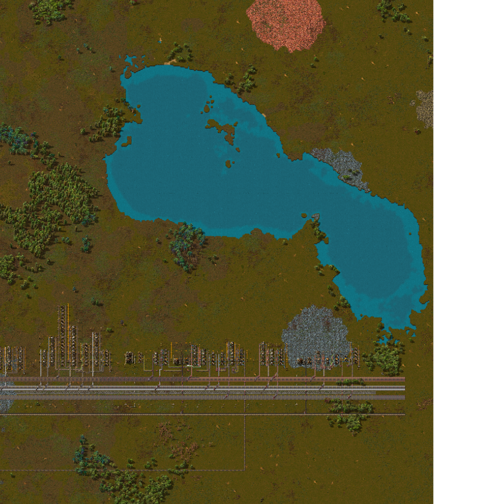

# Factorio Image Stitcher

## Overview
This Python Programm stitches multi part screenshots from the [FacAutoScreenshot](https://mods.factorio.com/mod/FacAutoScreenshot) mod together for the game [Factorio](https://www.factorio.com/).

Converts this:


To this:


## Installation
Tested for Python 3.10.1
It uses the [PILLOW Image Library](https://github.com/python-pillow/Pillow).

Install Pillow Image Library:
```
py -m pip install --upgrade Pillow
```

## Run the Programm
```
python .\imagestitcher.py
```
Then provide the input/output folder.

